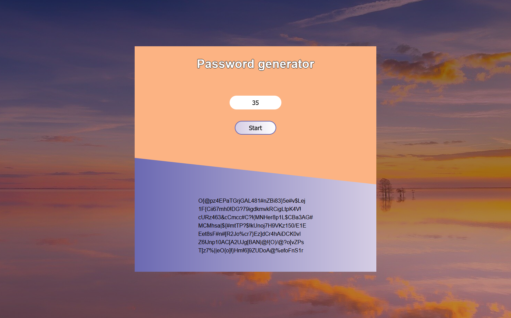

# Password Generator

Password generator generates passwords with random letters, numbers and characters.

<a href="https://veronikagregorec.github.io/password-generator/">Live Preview</a>

## Browser Compatibility

All of the latest versions of <b>Chrome</b>, <b>Firefox</b>, <b>Edge</b> and <b>Opera</b> browsers are supported.

## Installation

#### Steps to install

<ol>
  <li>download the folder/git clone the repo</li>
  <li>cd root directory of the folder</li>
  <li>access localhost:5500 on your browser</li>
</ol>

## Screenshot

You can enter a value from 1 to 50 and then press Start button. If you enter a number greater than 50, the input field will automatically leave the number 50. 
The password will be generated. It will be shown 7 different passwords in each row.

